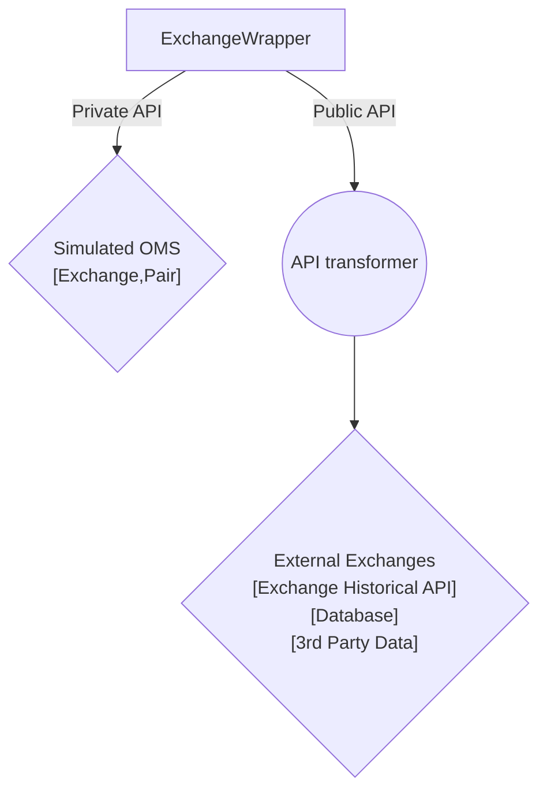
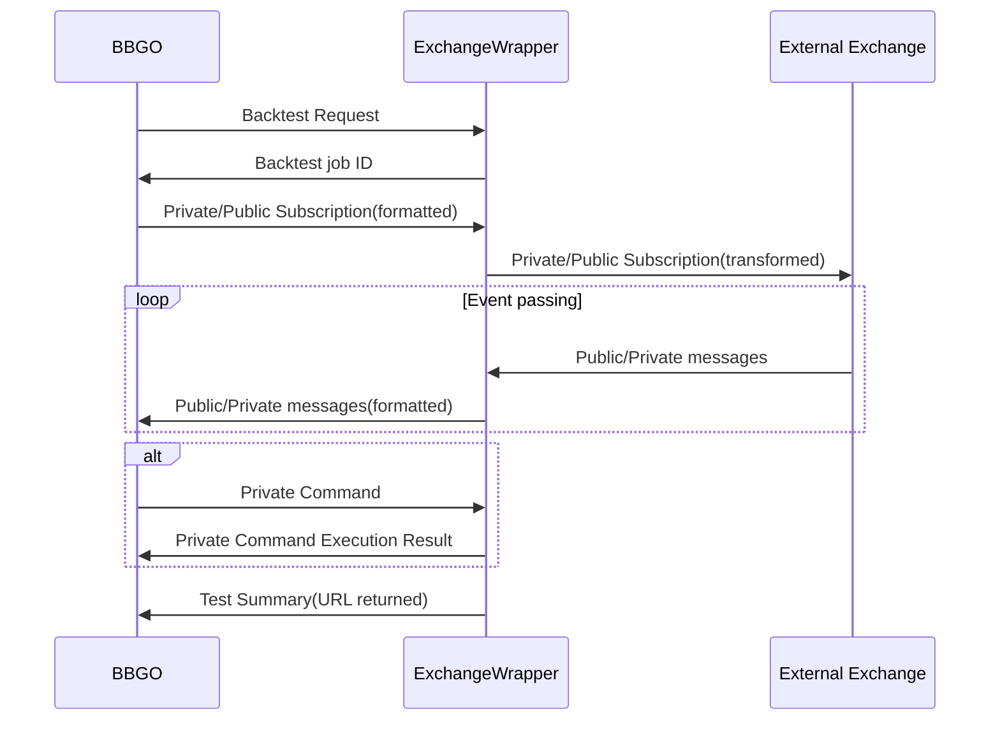

```mermaid
graph TD;
    A[ExchangeWrapper]-- Private API -->B{"Simulated OMS\n[Exchange,Pair]"};
    A--Public API-->C((API transformer));
    C-->D{"External Exchanges\n[Exchange Historical API]\n[Database]\n[3rd Party Data]"};
```

```mermaid
sequenceDiagram
    participant BBGO
    participant ExchangeWrapper
    participant External Exchange
    BBGO->>ExchangeWrapper: Backtest Request
    ExchangeWrapper->>BBGO: Backtest job ID
    BBGO->>ExchangeWrapper: Private/Public Subscription(formatted)
    ExchangeWrapper->>External Exchange: Private/Public Subscription(transformed)
    loop Event passing
        External Exchange->>ExchangeWrapper: Public/Private messages
        ExchangeWrapper->>BBGO: Public/Private messages(formatted)
    end
    alt
        BBGO->>ExchangeWrapper: Private Command
        ExchangeWrapper->>BBGO: Private Command Execution Result
    end
    ExchangeWrapper->>BBGO: Test Summary(URL returned)
```
